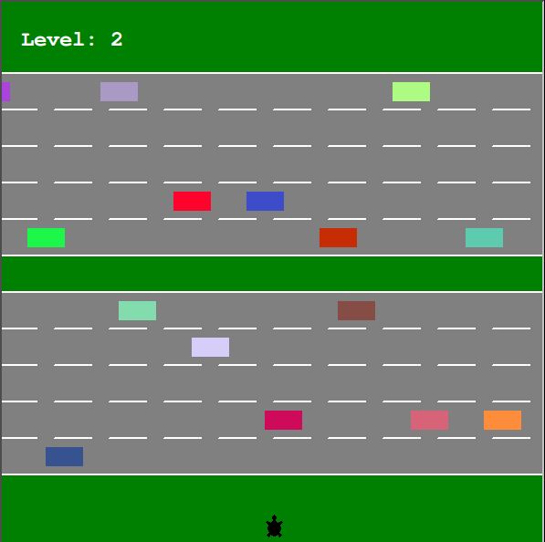

#### Turtle Crossing Game

Simple game created with turtle library and Python.

Player must get through busy road (5 lanes each direction) unharmed. Every time he/she manages to get to the other side speed of cars increases.
You can move only forward. Use up arrow key.

